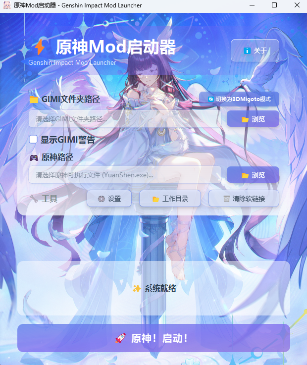
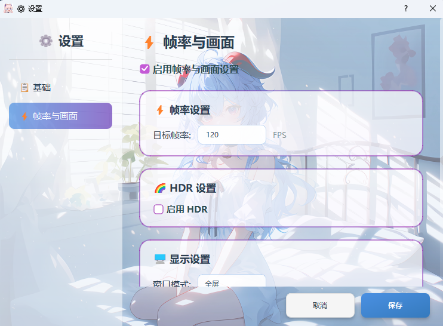
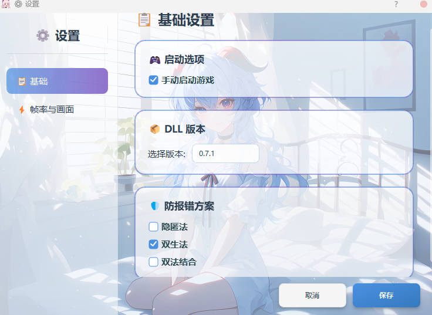
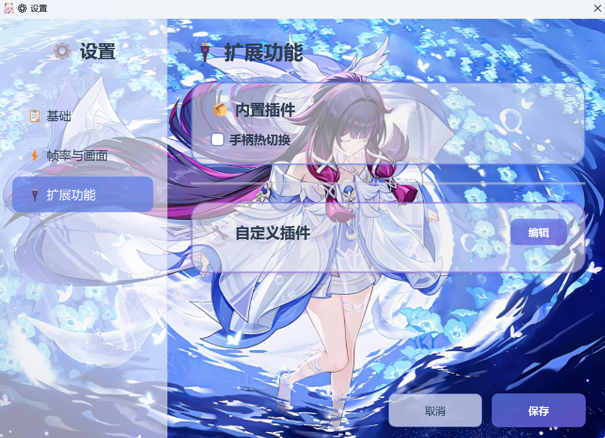

# Genshin Impact Mod Launcher (GIML)

[简体中文](README.md) | **English**

⚡ **GIML** — an error-prevention launcher built for running mods in Genshin Impact

**✅ Works with Genshin Impact 6.6**

<div align="center">
  

  <p>
    
    
    
    <a href="https://github.com/CHN-HelloWorld/GIML/releases/latest"></a>
  </p>

  **💬 QQ Group: [1075913947](https://qm.qq.com/q/qYrUfeigeI)**
</div>

> **Compatibility note**: This launcher successfully prevents game errors on most devices. If it doesn't work on yours, please be patient and wait for a future update.

---

## 📷 Screenshots

<div align="center">

<details open>
<summary><b>📱 Main Window</b></summary>
<br>

</details>

<details>
<summary><b>⚙️ Settings</b></summary>
<br>

<br><br>


</details>

<details>
<summary><b>✨ Result</b></summary>
<br>

</details>

</div>

---

## 📥 Quick Start

### System Requirements

| Item | Requirement |
|---|---|
| OS | Windows 10 / 11 |
| Privileges | Administrator (required to create symbolic links) |
| File system | The drive it runs from must be NTFS |
| Display | High-DPI adaptive, multi-monitor compatible |

### Installation

1. Download the latest release from the [Releases](https://github.com/CHN-HelloWorld/GIML/releases) page
2. Extract it to any folder (on an NTFS drive)
3. **Right-click the program → Run as administrator**

### First-Time Setup
> New XXMI users must launch the game through XXMI once first so that GIMI can initialize, before they can continue using GIML.
1. **Choose a working mode** (GIMI mode by default; switch to 3DMigoto mode with one click)

2. **Configure the folder path**

   | Mode | Target path to select | Required contents | Optional contents |
   |---|---|---|---|
   | GIMI | The GIMI directory of XXMI | Core, Mods, ShaderCache, ShaderFixes folders, and d3dx.ini | d3dcompiler_47.dll, d3dx_user.ini |
   | 3DMigoto | The 3DMigoto program directory (compatible with d3dxSkinManage's work directory) | Mods, ShaderCache, ShaderFixes folders, 3DMigoto Loader.exe, d3dx.ini | d3dcompiler_46.dll, d3dx_user.ini |

3. **Set the Genshin path** — select `YuanShen.exe` or `GenshinImpact.exe`

4. **Advanced settings (optional)** — click the ⚙️ Settings button to configure the DLL version, error-prevention methods, frame rate, extensions, and more

### Daily Use

> **Run as administrator** → **Click Launch** → **Auto-exits after 3 seconds**

> ⚠️ **Fair-play commitment**: When FPS unlock is enabled, the program automatically restores the native frame rate in scenes such as Miliastra Wonderland, Stygian Onslaught, the Spiral Abyss, and the Imaginarium Theater. High frame rates are only available during open-world exploration and other ordinary scenes. Combining it with macros or cheat tools is strictly prohibited!

---

## ⚙️ Settings

### Basic Settings

| Option | Description |
|---|---|
| DLL version | If you hit a "Disconnected from server" or "Illegal tool detected" error, try switching versions |
| Error-prevention methods | Traffic Interception / Stealth / Twin / Patch Inheritance — multiple selection supported, all enabled by default |
| Traffic Interception mode | Basic mode (does not affect other apps' networks) / Enhanced mode (stronger, but affects apps such as WeChat) |
| Manual game launch | Launches only the mod loader; you must start the game manually within 15 seconds |
| Launch delay | Wait time before the game auto-launches, range 1–7000 ms, default 1000 ms |
| Show GIMI warnings | Shows GIMI-related warnings in the top-left corner of the game window to help diagnose mod-loading issues (off by default) |

### Frame Rate & Display

Target frame rate, window mode, monitor selection, resolution, HDR, and more.

### Extensions

Path: ⚙️ Settings → 🔌 Extensions

**Built-in plugins**:
- **Controller hot-swap** — hot-plug a controller while the game is running and automatically switch the input device; just tick the box to enable

**Custom plugins**:

You can add `.dll` plugins (loaded into the game process) or `.exe` plugins (run when the game starts, with command-line argument support).

**Steps**: **Edit** → **Add** → enter a path or **Browse** to select a file → drag ☰ to reorder → **Save**

**Enable/Disable**: Outside edit mode, click the button next to a plugin item to **hot-toggle (enable/disable)** it. Disabled plugins don't need to be removed from the list entirely — you can re-enable them anytime.

> ⚠️ **Note**:
> - GIML does not verify whether a plugin is legitimate. Please ensure compliance yourself; any loss caused by a plugin is the user's responsibility.
> - If a plugin doesn't work / misbehaves / is incomplete under GIML, it is incompatible — please remove it.

### 🎨 Theme Settings

- **Path**: ⚙️ Settings → 🎨 Theme
- **Built-in themes**: Several beautifully designed character themes are included and switch automatically and seamlessly based on the time of day.
- **Custom themes**: When enabled, you can freely pick any of the past preset themes (they no longer switch automatically by time of day), and you can turn on "Random theme" mode.
- **Custom background images**: When enabled, you can separately customize the "home-page background" and "settings-page background", and additionally specify which theme color scheme to use. **You can select a single image or an entire image folder** — when a folder is selected, you can also set a "Random rotation" or "Rotate in name order" mode.

---

## 🚀 Launching GIML Automatically from the Command Line

> For advanced users — create a shortcut or batch script for one-click launching.

**Create a shortcut**:
1. Right-click the desktop → New → Shortcut
2. Set the target to `"D:\LauncherPath\GIML.exe" --auto-launch` (replace with your actual path)
3. Right-click the shortcut → Properties → Advanced → tick "Run as administrator"

**Example batch script**:
```batch
@echo off
cd /d "D:\LauncherPath"
GIML.exe --auto-launch
```

> ⚠️ Make sure you have completed all configuration in the UI before using this. If anything is misconfigured, the launcher will show an error and stop.

---

## ❓ FAQ

### Launch & Permissions

<details>
<summary><b>It says "Administrator privileges required"</b></summary>

Right-click the program → Run as administrator.
</details>

<details>
<summary><b>I'm already running as administrator but still get "Failed to create symbolic link"</b></summary>

Check whether the file system of the drive the launcher is on is NTFS. If not, move the launcher to an NTFS drive.
</details>

<details>
<summary><b>Nothing happens when I run GIML</b></summary>

Possible cause: an underlying dependency library doesn't support your device. Please try:
1. Check Windows Security → Protection history for any blocked entries; if there are any, allow them
2. Update your **integrated GPU driver** and try again

If it still doesn't work, your device is not supported by GIML for now.
</details>

<details>
<summary><b>A Windows Defender allowlist request dialog appears</b></summary>

This is normal. The launcher's error-prevention engine performs sensitive operations that Defender may flag as a false positive. We recommend agreeing to add it to the allowlist. If adding fails, you can ignore it — this step is not required.
</details>

### Errors & Protection

<details>
<summary><b>I get a "Disconnected from server" or "Illegal tool detected" error</b></summary>

Try the following in order:
1. Close all antivirus software and make sure all three error-prevention methods are enabled. If an error occurs, re-enter the game (do not kill the process) and observe again
2. Switch the DLL version in Settings → Basic; we recommend trying higher version numbers first (e.g. 0.7.0, 0.6.8)
3. Restart your device, clear the error cache (find a tool for this yourself), repair the client, keep the background clean (no mod-manager programs running), disable FPS unlock, and try again
</details>

<details>
<summary><b>What's the difference between the four error-prevention methods?</b></summary>

| Method | Characteristics |
|---|---|
| Traffic Interception | Filters transmitted traffic |
| Stealth | Traditional approach, stable and reliable |
| Twin | Lighter, faster to start, highly targeted |
| Patch Inheritance | Next-generation method; highly targeted, excellent effectiveness, and broad device compatibility. **The manual mode scenario has poor compatibility and may cause the game to crash. Restarting GIML and retrying can solve this problem.** |

All are enabled by default for the best protection.
</details>

<details>
<summary><b>Why can't Patch Inheritance and Twin be enabled at the same time?</b></summary>

The two methods use conflicting technical approaches and cannot work simultaneously. Enabling Patch Inheritance will automatically gray out and disable the Twin option. The recommended combination is Patch Inheritance + Stealth.
</details>

<details>
<summary><b>What's the difference between Basic and Enhanced mode for Traffic Interception?</b></summary>

| Mode | Characteristics |
|---|---|
| Basic | Doesn't affect other apps' networks; moderate effectiveness |
| Enhanced | More effective, but affects the network of apps such as WeChat |

Basic mode is the default. If Basic still produces errors, switch to Enhanced. **Enhanced mode does not need to be paired with Huorong interception.**
</details>

<details>
<summary><b>The launcher reports it is incompatible with the game version</b></summary>

Use the launcher's auto-repair feature. If errors persist after repair, please update the launcher.
</details>

<details>
<summary><b>It keeps showing a GIML violation notice</b></summary>

This message means the system has detected running live-streaming/broadcasting software (such as OBS, streaming companion apps, etc.). To protect the mod ecosystem and comply with the relevant rules, this launcher must not be used in a streaming environment.
Please fully close all streaming software and related processes in the background, then launch the game with GIML again.
</details>

### Mods & Game

<details>
<summary><b>Mods don't show up after launch</b></summary>

Please confirm that AI frame interpolation is disabled.
</details>

<details>
<summary><b>I can't find / I lost the data GIMI produced</b></summary>

The produced data lives in GIML's **working directory**, not the original GIMI directory. Click the "Working Directory" button on the home page to access it.
</details>

<details>
<summary><b>The game window disappears / the game crashes</b></summary>

- It is possible that both the "Patch Inheritance" and the "manual mode" were activated simultaneously. Generally, restarting GIML and retrying can solve this problem, or you can disable the "Patch Inheritance".
- An incompatible mod is in use — please track it down and remove it
- Move the launcher directory up one level. For example, if it was previously D:\1\2\GIML, move it up to D:\1\GIML
- d3dx.ini is misconfigured — use the official XXMI-GIMI or 3DMigoto-GIMI config files, not a third-party bundle
</details>

### Frame Rate & Display

<details>
<summary><b>What frame rate should I set?</b></summary>

We recommend matching your monitor's refresh rate: 60Hz→60FPS, 144Hz→144FPS, 240Hz→240FPS. The program automatically caps it at your monitor's maximum refresh rate.
</details>

<details>
<summary><b>The frame rate automatically drops in combat scenes</b></summary>

To maintain a fair game environment, the program automatically restores the native frame rate in scenes such as Miliastra Wonderland, Stygian Onslaught, and the Spiral Abyss, and restores your configured value once you leave.
</details>

<details>
<summary><b>Monitor-related issues</b></summary>

- **Launch fails after unplugging a monitor** — the program automatically switches to the primary monitor; you may need to click Launch twice the first time
- **Fewer resolutions after switching monitors** — this is normal; the program filters the available options based on the current monitor
- **UI glitches at high resolution** — check the scaling ratio in Windows display settings
</details>

### Extensions

<details>
<summary><b>Controller hot-swap doesn't work</b></summary>

Please confirm:
1. You've ticked "Controller hot-swap" on the Extensions page
2. The controller driver is installed correctly
</details>

---

## 👨‍💻 Project Info

| Item | Info |
|---|---|
| Name | GIML (Genshin Impact Mod Launcher) |
| Version | 2.5.2 |
| Author | Aether |
| License | Proprietary License |
| Last updated | June 10, 2026 |

## 🤝 Feedback & Support

- **GitHub Issues**: [Report an issue or suggestion](https://github.com/CHN-HelloWorld/GIML/issues)
- **QQ Group**: [1075913947](https://qm.qq.com/q/qYrUfeigeI)

## 📜 License

This software is proprietary (closed-source) and is provided for personal study, research, and non-commercial use only. See the [LICENSE](LICENSE) file for details.

- ✅ Completely free; commercial use is prohibited
- ✅ If you paid for it, use this notice to request a refund
- ⚠️ Decompiling, modifying, or creating derivative works is prohibited
- ⚠️ Please use it discreetly; large-scale promotion is strictly prohibited

> **Disclaimer**: This tool is for study and research only. Using mods may violate the game's terms of service; use at your own risk. We do not encourage using mods on official servers and recommend using them only on private servers.

---

## 💝 Support the Developer

**⚠️ This launcher depends on the game's ecosystem — please prioritize supporting the game over this launcher!**

If you find this project helpful, you can support the developer in the following ways:

<p align="center">
  
</p>

<p align="center">
  <em>Your support keeps us updating!</em>
</p>
