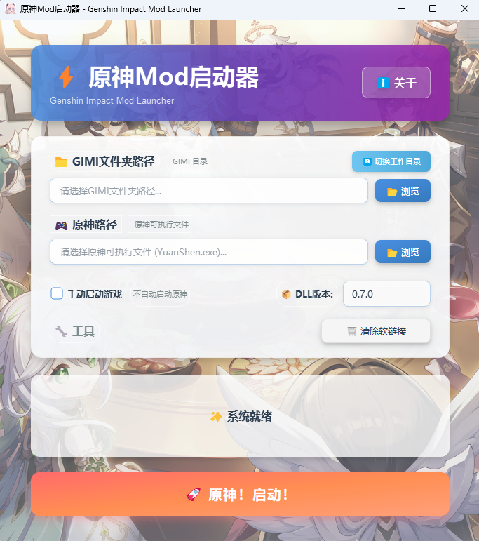

# 原神Mod启动器 (GIML)

⚡ **Genshin Impact Mod Launcher** - 专为原神玩家设计的优雅Mod启动工具

## ⚠️ 重要说明

**适用对象**：支持 XXMI 的 GIMI 加载器和 3DMigoto 的 work 目录两种模式

**兼容性提示**：本启动器目前仅在部分设备上可以有效规避游戏报错，尚未完全确定兼容性问题的根本原因。如果您的设备无法正常使用，请耐心等待后续版本更新。

## 程序界面

## 🖥️ 系统要求

- **操作系统**: Windows 10/11
- **权限要求**: 必须以管理员身份运行（创建软链接需要管理员权限）

## 📥 下载与安装

1. 从 [Releases](https://github.com/CHN-HelloWorld/GIML/releases) 页面下载最新版本
2. 解压到任意目录
3. **右键点击程序** → **以管理员身份运行**

> ⚠️ **重要**: 必须以管理员身份运行，否则无法创建软链接！

## ✨ 主要特性

### � 双模式支持
- **GIMI模式**：适用于 XXMI 的 GIMI 目录
- **work模式**：适用于 3DMigoto 的 work 目录
- 一键切换，配置互不干扰，自动保存

## �📋 使用指南

### 首次使用

1. **以管理员身份启动程序**
   - 右键点击程序图标 → 选择"以管理员身份运行"

2. **选择工作模式**
   - 程序默认为 **GIMI 模式**
   - 如需使用 3DMigoto 模式，点击路径配置项右上方的 **🔄 切换工作目录**
   - 工具提示：可在 XXMI 的 GIMI 目录和 3DMigoto 的 work 目录之间切换

3. **配置文件夹路径**

   #### GIMI 模式配置
   - 点击"浏览"按钮选择你的 GIMI 文件夹
   - 必须包含以下内容：
     - **必需文件夹**：Core、Mods、ShaderCache、ShaderFixes
     - **可选文件**：d3dcompiler_47.dll、d3dx_user.ini

   #### work 模式配置
   - 点击"浏览"按钮选择你的 work 文件夹
   - 必须包含以下内容：
     - **必需文件夹**：Mods、ShaderCache、ShaderFixes
     - **必需文件**：3DMigoto Loader.exe、d3dx.ini
     - **可选文件**：d3dcompiler_46.dll、d3dx_user.ini

4. **配置原神游戏路径**
   - 点击"浏览"按钮选择原神游戏的可执行文件
   - 如：`YuanShen.exe` 或 `GenshinImpact.exe`

5. **选择 DLL 版本（可选）**
   - 在"DLL版本"下拉框中选择文件版本
   - 默认使用稳定版本（0.7.0）
   - **使用建议**：
     - 一般情况下使用默认的稳定版本即可
     - 当游戏出现"与服务器断开连接"错误时，可以尝试切换 DLL 版本
     - 优先选择较高的版本号
     - 低版本文件可能会导致 Mod 出现某些兼容性问题

6. **选择启动模式（可选）**
   - 默认：自动启动所有工具和游戏
   - 勾选"手动启动游戏"：仅启动Mod加载工具，需手动启动游戏

7. **启动程序**
   - 点击"🚀 原神！启动！"按钮
   - 程序将自动完成所有处理并启动
   - 启动成功后，程序将在 3 秒后自动退出

### 日常使用

配置完成后，每次使用只需：
1. 以管理员身份运行程序
2. 点击"🚀 原神！启动！"按钮
3. 等待自动处理完成

### 模式切换

- 点击路径配置项右上方的 **🔄 切换工作目录** 即可在 GIMI 和 work 模式间切换
- 两种模式的配置独立保存，切换后自动恢复之前的配置
- 清除软链接功能会根据当前模式自动适配

## ⚠️ 注意事项

### 重要提示

1. **管理员权限**
   - 必须以管理员身份运行程序，否则无法创建软链接

2. **模式选择**
   - **GIMI 模式**：用于 XXMI 的 GIMI 目录
   - **work 模式**：用于 3DMigoto 的 work 目录
   - 两种模式配置独立，互不影响

3. **路径配置**
   - **GIMI 模式必需**：Core、Mods、ShaderCache、ShaderFixes 文件夹
   - **work 模式必需**：Mods、ShaderCache、ShaderFixes 文件夹，以及 3DMigoto Loader.exe、d3dx.ini 文件
   - 原神游戏路径必须指向正确的可执行文件

4. **文件安全**
   - 程序会智能识别实际文件和软链接
   - 仅删除软链接和复制的文件，不会删除实际文件
   - 不要在运行时移动 GIMI 或 work 文件夹

5. **自动退出**
   - 启动成功后程序将在 3 秒后自动退出
   - 无论是否点击确认按钮都会自动退出

### 常见问题

**Q: 启动时提示"需要管理员权限"？**  
A: 右键点击程序，选择"以管理员身份运行"。

**Q: 如何在 GIMI 和 work 模式之间切换？**  
A: 点击路径配置项右上方的 🔄 切换工作目录按钮即可。两种模式的配置会自动保存，切换后会恢复之前的配置。

**Q: work 模式下提示缺少文件？**  
A: work 模式必须包含 3DMigoto Loader.exe 和 d3dx.ini 文件，请检查 work 文件夹是否完整。

**Q: 软链接创建失败？**  
A: 检查是否以管理员身份运行，以及文件夹路径是否正确。

**Q: 游戏启动失败？**  
A: 检查原神游戏路径是否正确，确保指向可执行文件。

**Q: 出现"与服务器断开连接"错误？**  
A: 尝试在"DLL版本"下拉框中切换不同的版本，建议优先选择较高版本号（如 0.7.0、0.6.8 等）。不同设备可能需要不同的 DLL 版本才能正常运行。

**Q: Mod 加载后出现异常问题？**  
A: 可能是 DLL 版本不兼容导致，建议切换到较高版本的 DLL。低版本文件可能会使 Mod 出现某些兼容性问题。

**Q: 程序自动退出太快？**  
A: 启动成功后程序会在 3 秒后自动退出，这是正常设计。

**Q: 配置丢失？**  
A: 配置保存在 `config/config.ini`，确保该文件未被删除。

**Q: 清除软链接后需要重新配置吗？**  
A: 不需要，清除软链接只是删除链接文件，不会清除配置。下次启动时会自动重新创建软链接。

## 👨‍💻 项目信息

- **项目名称**: GIML (Genshin Impact Mod Launcher)
- **版本**: 1.5.0
- **作者**: Aether
- **许可证**: 专有软件许可证（Proprietary License）

## 🤝 反馈与支持

如遇到问题或有建议，欢迎在 [Issues](https://github.com/CHN-HelloWorld/GIML/issues) 页面提交反馈。

## 📜 许可证

本软件为专有软件（闭源），仅供个人学习、研究和非商业用途使用。详见 [LICENSE](LICENSE) 文件。

**重要声明**：
- ✅ 本软件完全免费，禁止任何形式的商业使用
- ✅ 若您付费购买本软件，请凭此说明联系卖家退款
- ⚠️ 禁止反编译、修改或创建衍生作品
- ⚠️ 请低调使用，严禁大肆宣传

## 🙏 致谢

感谢所有为原神Mod社区做出贡献的开发者和玩家！

---

**免责声明**: 本工具仅供学习和研究使用。使用Mod可能违反游戏服务条款，请自行承担风险。

**最后更新**: 2025年10月17日
