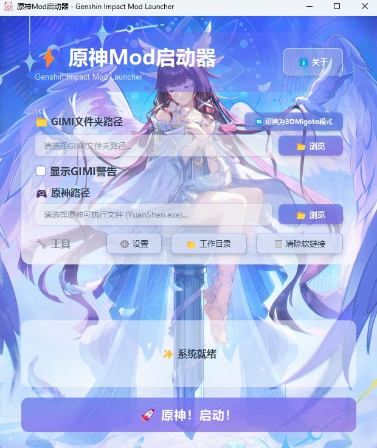
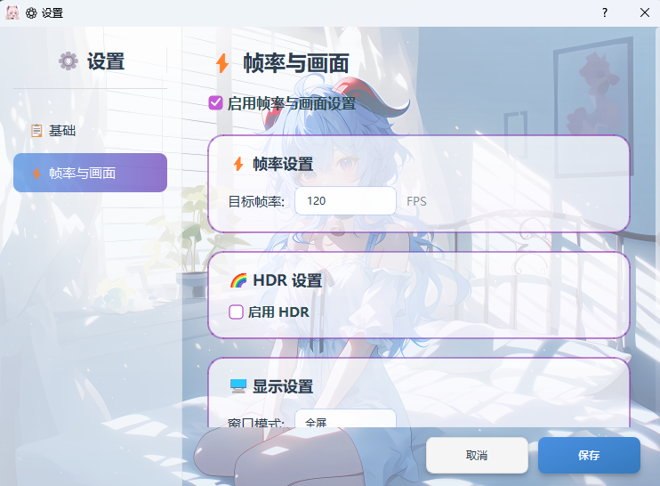
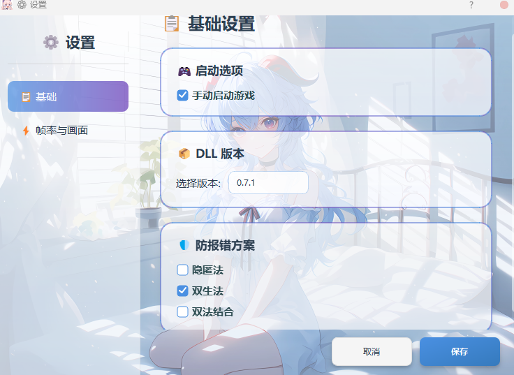

# 原神 Mod 启动器 (GIML)

⚡ **Genshin Impact Mod Launcher** - 专为原神玩家设计的 Mod 防报错启动工具

## 6.2 版本依旧可用

## ⚠️ 重要说明

**适用对象**：支持 XXMI 的 GIMI 加载器和 3DMigoto 的 work 目录两种模式

**兼容性提示**：本启动器目前仅在部分设备上有效规避游戏报错，尚未完全确定兼容性问题的根本原因。如果您的设备无法正常使用，请耐心等待后续版本更新。

## 程序界面

## 运行效果

## 🖥️ 系统要求

- **操作系统**: Windows 10/11
- **权限要求**: 必须以管理员身份运行（创建软链接需要管理员权限）
- **显示支持**: 支持高 DPI 屏幕自适应，兼容多显示器配置

## 📥 下载与安装

1. 从 [Releases](https://github.com/CHN-HelloWorld/GIML/releases) 页面下载最新版本
2. 解压到任意目录
3. **右键点击程序** → **以管理员身份运行**

> ⚠️ **重要**: 必须以管理员身份运行，否则无法创建软链接！

## ✨ 主要特性

### 🔄 双模式支持

- **GIMI 模式**：适用于 XXMI 的 GIMI 目录
- **work 模式**：适用于 3DMigoto 的 work 目录
- 一键切换，配置互不干扰，自动保存

### 🎮 集成 FPS 解锁器

- **内置帧率解锁工具**：无需额外下载配置，稳定可靠
- **多种窗口模式**：窗口化、无边框、全屏、独占全屏
- **智能帧率限制**：自动适配显示器最高刷新率，防止过度设置
- ⚠️ **公平游戏承诺**：为维护公平的游戏环境，程序会在千星奇遇、幽境危战、深境螺旋、幻想真境剧诗等战斗场景中自动将帧率恢复为游戏原生水平，仅在大世界探索时开放高帧率功能。此功能旨在防止不当使用影响游戏平衡。
- **HDR 支持**：支持 HDR 显示模式
- **多显示器智能适配**：可选择任意显示器启动游戏，支持显示器热插拔
- **分辨率智能管理**：
  - 窗口化/无边框模式：自由选择预设分辨率
  - 全屏模式：自动使用显示器原生分辨率
  - 切换显示器时自动推荐最佳分辨率
  - 显示器配置失效时（如拔掉第二显示器）智能回退到主显示器
- > ⚠️ **警告**：请合理使用解帧功能，严禁结合任何宏或其他作弊工具破坏游戏平衡。此类行为将损害社区整体利益，并可能导致账号封禁。请保持低调，共同维护公平的游戏环境。

### ⚙️ 灵活的设置系统

- **基础设置**：
  - **DLL 版本选择**：支持多个 DLL 版本切换，遇到"与服务器断开连接"可尝试切换版本
  - **防报错方案**：提供三种防报错策略，根据您的需求选择
    - **隐匿法**：默认，传统方案
    - **双生法**：自研新方案
    - **双法结合**：上面两种方法结合，双重防护
  - **手动启动游戏**：仅启动 Mod 加载器，您可手动启动游戏
- **帧率与画面设置**：完整的游戏显示和性能配置

### 🎨 现代化界面

- **高 DPI 适配**：完美支持各种分辨率显示器和各种缩放比例

## 📋 使用指南

### 首次使用

1. **以管理员身份启动程序**

   - 右键点击程序图标 → 选择"以管理员身份运行"
   - 程序会自动检测管理员权限，如果权限不足会提示

2. **选择工作模式**

   - 程序默认为 **GIMI 模式**
   - 如需使用 3DMigoto 模式，点击 **切换为 3DMigoto 模式** 按钮
   - 模式切换后按钮文字会相应改变

3. **配置文件夹路径**

   #### GIMI 模式配置

   - 点击"浏览"按钮选择你的 GIMI 文件夹
   - 必须包含以下内容：
     - **必需文件夹**：Core、Mods、ShaderCache、ShaderFixes
     - **可选文件**：d3dcompiler_47.dll、d3dx_user.ini

   #### work 模式配置

   - 点击"浏览"按钮选择你的 work 文件夹
   - 必须包含以下内容：
     - **必需文件夹**：Mods、ShaderCache、ShaderFixes
     - **必需文件**：3DMigoto Loader.exe、d3dx.ini
     - **可选文件**：d3dcompiler_46.dll、d3dx_user.ini

4. **配置原神游戏路径**

   - 点击"浏览"按钮选择原神游戏的可执行文件（如：`YuanShen.exe` 或 `GenshinImpact.exe`）

5. **高级设置（可选）**

   - 点击主界面的 **⚙️ 设置** 按钮打开设置窗口
   - **基础设置**：
     - **DLL 版本**：选择要使用的 DLL 版本（遇到"与服务器断开连接"可尝试切换）
     - **防报错方案**：选择防报错策略（三选一）
       - **隐匿法**（默认）：传统方案，稳定可靠
       - **双生法**：新方案，更轻量，大幅加快启动速度，对报错更有针对性
       - **双法结合**：双重防护
     - **手动启动游戏**：勾选后仅启动 Mod 加载器，您需在 10 秒内手动启动游戏
   - **帧率与画面设置**：
     - 目标帧率（自动匹配显示器最高刷新率）
     - 窗口显示模式（窗口化、无边框、全屏、独占全屏）
     - 显示器选择（支持多显示器配置）
     - 自定义分辨率（窗口化/无边框模式可自由选择预设分辨率）
     - HDR 显示支持
   - 配置好后点击"保存"按钮

6. **启动程序**
   - 点击"🚀 原神！启动！"按钮
   - 启动成功后程序将在 3 秒后自动退出

### 日常使用

配置完成后，每次使用只需：

1. 以管理员身份运行程序
2. 点击"🚀 原神！启动！"按钮
3. 等待自动处理完成（约 3 秒后程序自动退出）

## ⚠️ 注意事项

### 重要提示

1. **管理员权限**：必须以管理员身份运行，否则无法创建软链接
2. **文件安全**：程序仅删除软链接和复制的文件，不会删除实际文件
3. **自动退出**：启动成功后程序将在 3 秒后自动退出
4. **帧率建议**：帧率上限将自动匹配您选择的显示器刷新率，请根据电脑性能合理设置
5. **公平游戏机制**：在千星奇遇、幽境危战、深境螺旋、幻想真境剧诗等战斗场景中，程序会自动将帧率限制为游戏原生水平，仅在大世界探索时开放高帧率，以维护公平的游戏环境
6. **多显示器支持**：支持显示器热插拔，如果保存的显示器配置失效（如拔掉第二显示器），程序会自动切换到主显示器并使用合适的分辨率

### 常见问题

**Q: 启动时提示"需要管理员权限"？**  
A: 右键点击程序，选择"以管理员身份运行"。

**Q: 如何在 GIMI 和 work 模式之间切换？**  
A: 点击主界面的切换按钮即可，配置会自动保存。

**Q: 出现"与服务器断开连接"错误？**  
A: 在"设置"→"基础"中切换不同的 DLL 版本，推荐优先选择较高版本号（如 0.7.0、0.6.8）。

**Q: 不同防报错方案有什么区别？**  
A:

- **隐匿法**： 默认，传统方案，稳定可靠
- **双生法**：新方案，更轻量，大幅加快启动速度，对报错更有针对性
- **双法结合**：双重防护，防护更全面但处理时间稍长

如果您不确定选哪个，保持默认的"隐匿法"即可。

**Q: FPS 解帧器如何使用？**  
A: 在"设置"→"帧率与画面"中勾选"启用帧率与画面设置"，然后配置目标帧率和窗口模式等选项。帧率上限将自动匹配您选择的显示器刷新率。

**Q: 帧率应该设置多少合适？**  
A: 建议根据您的显示器刷新率设置，如 60Hz 显示器设置 60FPS，144Hz 设置 144FPS，240Hz 设置 240FPS。程序会自动将帧率上限设定为显示器的最高刷新率。

**Q: 为什么在战斗场景中帧率会自动降低？**  
A: 为维护公平的游戏环境，程序会在千星奇遇、幽境危战、深境螺旋、幻想真境剧诗等战斗场景中自动恢复游戏原生帧率。离开这些场景后，帧率会自动恢复到您设置的值。这是反作弊保护机制，防止高帧率影响游戏平衡。

**Q: 窗口化/无边框模式下可以自定义分辨率吗？**  
A: 可以！在"设置"→"帧率与画面"中选择窗口化或无边框模式后，可以从分辨率下拉框中选择合适的分辨率

**Q: 拔掉第二个显示器后启动失败怎么办？**  
A: 程序会自动检测显示器配置变化，如果保存的显示器不存在了，会自动切换到主显示器并使用合适的分辨率。第一次可能需要点击启动按钮两次，之后就会正常工作。

**Q: 切换显示器后分辨率选项变少了？**  
A: 这是正常的，程序会根据当前显示器的原生分辨率过滤出合适的预设选项，并自动推荐最大的可用分辨率。

**Q: 高分辨率显示器上 UI 显示异常？**  
A: 程序支持高 DPI 自适应，请检查 Windows 系统显示设置中的缩放比例。

**Q: 清除软链接后需要重新配置吗？**  
A: 不需要，配置不会丢失，下次启动时会自动重新创建软链接。

**Q: 启动器报错与游戏版本不兼容？**  
A: 使用启动器的自动修复即可

## 💡 程序特点

- **简单易用**：一键启动，自动处理软链接
- **双模式支持**：GIMI 和 work 模式快速切换
- **多种防报错方案**：隐匿法、双生法、双法结合，满足不同需求
- **智能解帧**：内置 FPS 解锁器，自动适配显示器刷新率，多种窗口模式，智能多显示器支持
- **公平游戏保护**：战斗场景智能限制帧率，维护游戏平衡
- **分辨率自由**：窗口化/无边框模式可自定义分辨率
- **美观界面**：现代化设计，完美支持高 DPI 显示器
- **安全可靠**：智能识别文件，仅删除软链接
- **热插拔支持**：显示器配置变化时自动适配，无需手动调整

## 👨‍💻 项目信息

- **项目名称**: GIML (Genshin Impact Mod Launcher)
- **版本**: 2.0.8
- **作者**: Aether
- **许可证**: 专有软件许可证（Proprietary License）
- **更新时间**: 2025 年 12 月 11 日

## 🤝 反馈与支持

如遇到问题或有建议，欢迎在 [Issues](https://github.com/CHN-HelloWorld/GIML/issues) 页面提交反馈。

## 📜 许可证

本软件为专有软件（闭源），仅供个人学习、研究和非商业用途使用。详见 [LICENSE](LICENSE) 文件。

**重要声明**：

- ✅ 本软件完全免费，禁止任何形式的商业使用
- ✅ 若您付费购买本软件，请凭此说明联系卖家退款
- ⚠️ 禁止反编译、修改或创建衍生作品
- ⚠️ 请低调使用，严禁大肆宣传

## 🙏 致谢

感谢所有为原神 Mod 社区做出贡献的开发者和玩家！

---

**免责声明**: 本工具仅供学习和研究使用。使用 Mod 可能违反游戏服务条款，请自行承担风险。我们不提倡在正式服务器使用 Mod，建议仅在私人服务器使用。

**最后更新**: 2025 年 12 月 11 日
