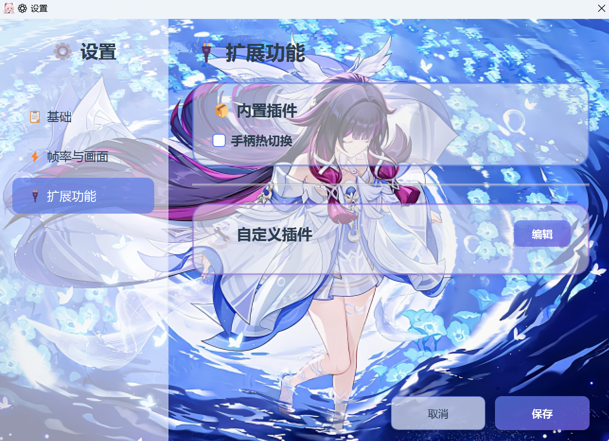

# 原神 Mod 启动器 (GIML)

⚡ **Genshin Impact Mod Launcher** — 专为原神设计的 Mod 防报错启动工具

**✅ 6.4 版本可用**

<div align="center">
  

  <p>
    
    
    
    <a href="https://github.com/CHN-HelloWorld/GIML/releases/latest"></a>
  </p>

  **💬 QQ 交流群：[1075913947](https://qm.qq.com/q/qYrUfeigeI)**
</div>

> **兼容性提示**：本启动器在大部分设备上有效规避游戏报错。如果您的设备无法正常使用，请耐心等待后续版本更新。

---

## 📷 程序界面

<div align="center">

<details open>
<summary><b>📱 主界面</b></summary>
<br>

</details>

<details>
<summary><b>⚙️ 设置界面</b></summary>
<br>

<br><br>


</details>

<details>
<summary><b>✨ 运行效果</b></summary>
<br>

</details>

</div>

---

## 📥 快速开始

### 系统要求

| 项目 | 要求 |
|---|---|
| 操作系统 | Windows 10 / 11 |
| 权限 | 管理员权限（创建软链接需要） |
| 文件系统 | 所在盘符须为 NTFS |
| 显示 | 高 DPI 自适应，多显示器兼容 |

### 安装步骤

1. 从 [Releases](https://github.com/CHN-HelloWorld/GIML/releases) 页面下载最新版本
2. 解压到任意目录（NTFS 盘符）
3. **右键程序 → 以管理员身份运行**

### 首次配置

1. **选择工作模式**（默认 GIMI 模式，可一键切换至 3DMigoto 模式）

2. **配置文件夹路径**

   | 模式 | 选择目标路径 | 必需内容 | 可选内容 |
   |---|---|---|---|
   | GIMI | XXMI 的 GIMI 目录 | Core、Mods、ShaderCache、ShaderFixes 文件夹，d3dx.ini | d3dcompiler_47.dll、d3dx_user.ini |
   | 3DMigoto | 3DMigoto 程序目录（兼容 d3dxSkinManage 的 work 目录） | Mods、ShaderCache、ShaderFixes 文件夹，3DMigoto Loader.exe、d3dx.ini | d3dcompiler_46.dll、d3dx_user.ini |

3. **配置原神路径** — 选择 `YuanShen.exe` 或 `GenshinImpact.exe`

4. **高级设置（可选）** — 点击 ⚙️ 设置 按钮配置 DLL 版本、防报错方案、帧率、扩展功能等

### 日常使用

> **管理员运行** → **点击启动** → **3 秒后自动退出**

> ⚠️ **公平游戏承诺**：若开启了解帧，在千星奇遇、幽境危战、深境螺旋、幻想真境剧诗等场景中，程序会自动恢复原生帧率，仅在大世界探索或其他普通场景开放高帧率。严禁结合宏或作弊工具使用！

---

## ⚙️ 设置说明

### 基础设置

| 选项 | 说明 |
|---|---|
| DLL 版本 | 遇到"与服务器断开连接"或"非法工具"错误时可尝试切换版本 |
| 防报错方案 | 截流法 / 隐匿法 / 双生法，支持多选，默认全选 |
| 截流法拦截模式 | 基础模式（不影响其他应用网络） / 增强模式（效果更强，会影响微信等应用网络） |
| 手动启动游戏 | 仅启动 Mod 加载器，需在 15 秒内手动启动游戏 |
| 延迟启动时间 | 自动启动游戏前的等待时间，范围 1–7000ms，默认 1000ms |
| 显示 GIMI 警告 | 在游戏窗口左上角显示 GIMI 相关警告，方便排查 Mod 加载问题（默认关闭） |

### 帧率与画面

目标帧率、窗口模式、显示器选择、分辨率、HDR 等。

### 扩展功能

路径：⚙️ 设置 → 🔌 扩展功能

**内置插件**：
- **手柄热切换** — 游戏运行时热插拔手柄并自动切换输入设备，勾选即可启用

**自定义插件**：

支持添加 `.dll`（加载到游戏进程）或 `.exe`（游戏启动时运行，支持命令行参数）插件。

操作步骤：**编辑** → **新增** → 输入路径或 **浏览** 选择文件 → 拖动 📌 调整顺序 → **保存**

> ⚠️ **注意**：
> - GIML 不检查插件合法性，请自行保证合规性，因插件造成的损失由用户承担。
> - 若插件在 GIML 下运行无效/异常/功能不全，说明该插件不兼容，请移除。

---

## 🚀 命令行自动启动GIML

> 适合进阶用户，用于创建快捷方式或批处理脚本实现一键启动。

**创建快捷方式**：
1. 右键桌面 → 新建 → 快捷方式
2. 目标路径填写 `"D:\启动器路径\GIML.exe" --auto-launch`（替换为实际路径）
3. 右键快捷方式 → 属性 → 高级 → 勾选"用管理员身份运行"

**批处理脚本示例**：
```batch
@echo off
cd /d "D:\启动器路径"
GIML.exe --auto-launch
```

> ⚠️ 使用前请确保已在界面中完成所有配置。配置有误时启动器会弹出错误提示并停止运行。

---

## ❓ 常见问题

### 启动与权限

<details>
<summary><b>提示"需要管理员权限"</b></summary>

右键程序 → 以管理员身份运行。
</details>

<details>
<summary><b>已用管理员启动，仍报错"创建软链接失败"</b></summary>

请检查启动器所在盘符的文件系统是否为 NTFS。若不是，请将启动器移动到 NTFS 盘符下。
</details>

<details>
<summary><b>运行 GIML 没反应</b></summary>

可能原因：底层依赖库不支持您的设备。请尝试：
1. 检查 Windows 安全中心 → 保护历史记录，是否有拦截记录，若有请允许
2. 更新 **集显驱动** 后重试

若仍无效，则当前设备暂不支持 GIML。
</details>

<details>
<summary><b>出现 Windows Defender 白名单申请对话框</b></summary>

正常现象。启动器的防报错引擎存在敏感行为，可能被 Defender 误报。建议同意添加白名单。若添加失败可忽略，此步骤非必须。
</details>

### 报错与防护

<details>
<summary><b>出现"与服务器断开连接"或"非法工具"错误</b></summary>

请依次尝试：
1. 关闭所有杀毒软件，确保三种防报错方案全部勾选。若报错，重新进游戏（不要关闭进程）再观察
2. 在 设置 → 基础 中切换 DLL 版本，推荐优先选择较高版本号（如 0.7.0、0.6.8）
3. 重启设备，清除报错缓存（工具需自行寻找），修复客户端，后台保持干净（无 Mod 管理器程序），关闭解帧功能后重试
</details>

<details>
<summary><b>三种防报错方案有什么区别？</b></summary>

| 方案 | 特点 |
|---|---|
| 截流法 | 过滤传输流量 |
| 隐匿法 | 传统方案，稳定可靠 |
| 双生法 | 更轻量、启动更快、针对性强 |

默认全选以获得最佳防护效果。
</details>

<details>
<summary><b>截流法基础模式和增强模式有什么区别？</b></summary>

| 模式 | 特点 |
|---|---|
| 基础模式 | 不影响其他应用网络，效果一般 |
| 增强模式 | 效果更佳，但会影响微信等应用的网络 |

默认基础模式。若基础模式仍报错可切换增强模式。**使用增强模式无需配合火绒拦截。**
</details>

<details>
<summary><b>启动器报错与游戏版本不兼容</b></summary>

使用启动器的自动修复功能。若修复后仍报错，请更新启动器。
</details>

### Mod 与游戏

<details>
<summary><b>启动后不显示 Mod</b></summary>

请确认是否关闭了 AI 插帧功能。
</details>

<details>
<summary><b>GIMI 产出的数据找不到 / 丢失</b></summary>

产出的数据位于 GIML 的 **工作目录** 下，而非原始 GIMI 目录。点击主页的"工作目录"按钮即可访问。
</details>

<details>
<summary><b>游戏窗口不见 / 游戏崩溃</b></summary>

- 使用了不兼容的 Mod —— 请排查并移除
- d3dx.ini 配置不正确 —— 请使用 XXMI-GIMI 或 3DMigoto-GIMI 官方配置文件，而非第三方整合
</details>

### 帧率与显示

<details>
<summary><b>帧率应该设置多少？</b></summary>

建议与显示器刷新率一致：60Hz→60FPS，144Hz→144FPS，240Hz→240FPS。程序会自动将上限设为显示器最高刷新率。
</details>

<details>
<summary><b>战斗场景帧率自动降低</b></summary>

为维护公平游戏环境，程序在千星奇遇、幽境危战、深境螺旋等场景中自动恢复原生帧率，离开后自动恢复设置值。
</details>

<details>
<summary><b>显示器相关问题</b></summary>

- **拔掉显示器后启动失败** — 程序会自动切换到主显示器，首次可能需要点击启动两次
- **切换显示器后分辨率变少** — 正常现象，程序根据当前显示器过滤可用选项
- **高分辨率 UI 异常** — 检查 Windows 显示设置中的缩放比例
</details>

### 扩展功能

<details>
<summary><b>手柄热切换功能无法使用</b></summary>

请确认：
1. 已在 扩展功能 页面勾选"手柄热切换"
2. 手柄驱动已正确安装
</details>

---

## 👨‍💻 项目信息

| 项目 | 信息 |
|---|---|
| 名称 | GIML (Genshin Impact Mod Launcher) |
| 版本 | 2.2.0 |
| 作者 | Aether |
| 许可证 | 专有软件许可证 (Proprietary License) |
| 更新时间 | 2026 年 2 月 25 日 |

## 🤝 反馈与支持

- **GitHub Issues**：[提交问题或建议](https://github.com/CHN-HelloWorld/GIML/issues)
- **QQ 交流群**：[1075913947](https://qm.qq.com/q/qYrUfeigeI)

## 📜 许可证

本软件为专有软件（闭源），仅供个人学习、研究和非商业用途使用。详见 [LICENSE](LICENSE) 文件。

- ✅ 完全免费，禁止商业使用
- ✅ 若付费购买，请凭此说明退款
- ⚠️ 禁止反编译、修改或创建衍生作品
- ⚠️ 请低调使用，严禁大肆宣传

> **免责声明**：本工具仅供学习和研究使用。使用 Mod 可能违反游戏服务条款，请自行承担风险。我们不提倡在正式服务器使用 Mod，建议仅在私人服务器使用。

---

## 💝 赞赏支持

**⚠️ 本启动器依赖游戏生态，请优先考虑支持游戏而不是本启动器！**

如果您觉得本项目对您有帮助，可以通过以下方式支持开发者：

<p align="center">
  
</p>

<p align="center">
  <em>您的支持是我们持续更新的动力！</em>
</p>
